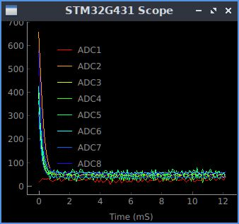
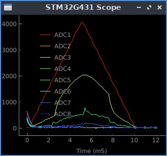
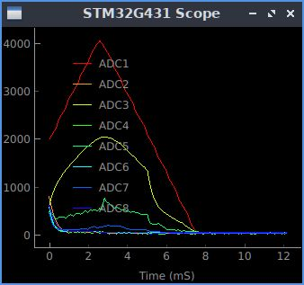
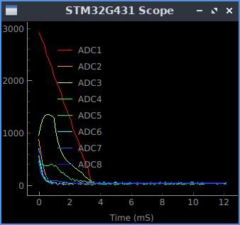
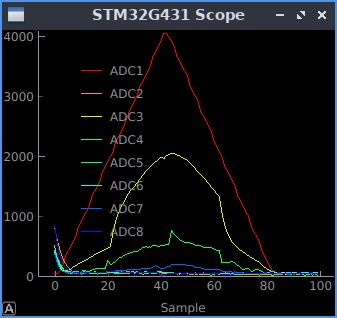
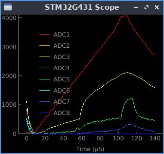

# stm32genscope.: general purpose analog/digital FrontEnd Controller, running on 
NUCLEO-G431KB board.
Development, control, monitoring and data transfer of STM32 MCU boards.
- Development platform: STM32CubeIDE.
- Development language: C++.
- Development host OS: linux.
- Connection to host, power and debugging are all through a USB2 link. Typical power consumption: 1 Watt.
- Communication with host: through linux serial port /dev/ttyACM, with bit rate 10 Mbaud.
- The software archictecture is similar to ADO or EPICS. Board holds Process Variables (PVs) similar to ADO parameters and responds to following requests: **info**, **get** and **set**.
- The transmitted data are binary packets with 4-byte header and arbitrary payload. The streamed ADC packets have binary pyloads, the communication packes have payloads with **JSON**-packed text.
- Typical source code size is 3-10 KB.
- Remote restart using usbreset command.

Implemented on a [NUCLEO G431KB evaluation board](https://www.st.com/en/evaluation-tools/nucleo-g431kb.html). 
The board configuration and pin assignment could be found [**here**](/stm32genscope.pdf).
- Eight of 12-bit ADC channels, sampling rate is up to ~3 Msps, range: 0 to 3.3V.
- One Arbitrary Waveform Generator (WFG), also working as DAC: 12-bit, up to 2 Msps.
- One Gate Delay Generator (GDG), 32-bit, resolution 6 ns.
- One Pulse Width Modulation (Pulser), 16-bit, resolution 6 ns.
- Eight digital GPIO, some of them could be configured as serial interfaces (RS232, Modbus, RS485, SPI, I2C).
- CPU: ARM Cortex-M4, 32bit, 170 MHz.
- ART Accelerator, FPU, DSP, DSP performance: 0.3 ms for 1024 point FFT.  
- Interrupt reaction time: ~500 ns, deterministic.

## Dependencies
- PyQt5-5.15.1+ for stmscope.py
- STM32CubeIDE v1.14.0

# Build from scratch.
## Building a minimal C code
- Start STM32CubeIDE
- Click `File/New/STM32 Project`
- Click `Board Selector`
- Select NUCLEO-G431KB
- Enter 'Project Name:' stm32genscope, `Targeted Language:` C++, `Finish`.
- Click Project `Generate Code`. You may be asked to update firmware.
- Add the following code in main.c after /* USER CODE END WHILE */:
      HAL_GPIO_TogglePin(GPIOB,GPIO_PIN_8);
      HAL_Delay(1000);
- Click Run/Debug.
- Click F8. The green LED should blink at 0.5 Hz.

## Converting to C++
- In Project explorer: rename Core/Src/main.c to Core/Src/main.cpp
- Make sure you have the following code in main.cpp after /* USER CODE END WHILE */:
      HAL_GPIO_TogglePin(GPIOB,GPIO_PIN_8);
      HAL_Delay(500);
- In Project explorer: click Convert to C++
- Project/Clean. It should re-build everything and end up with
- Click: Run/Debug.
- Click: F8. The green LED should blink at 1 Hz.

## Add user code for stm32genscope
- Replace following project files with corresponding files from the git repository:
```./stm32genscope.ioc
./Core/Src/main.cpp
./Core/Inc/stm32genscope.h```
- Click Project/Generate code. It will produce ./Core/Src/main.c, it need to be 
removed as it will shadow our ./Core/Src/main.cpp
- In Project Explorer: delete ./Core/Src/main.c.
- Click: Project/Clean. It should re-build everything and it should not be errors in Console
- Click: Run/Debug.
- Click: F8 to run the board in debugging mode.

# Quick Test
- Connect Pulser Output TIM4_CH1 (PA11) to TrigADC input TIM1_CH1 (PA8).
Connect WFG output (PA5) to ADC1 input (PA0).
- Connect NUCLEO-G431KB to a USB port. 
- Start stmscope.py:
```
$python3 python/stmscope.py -n -q -g
```

The stmscope.py accepts the following text commands from terminal:
```
- info          # list of all supported PVs.
- info pv       # info on a particular PV.
- get pv        # get value object of a PV.
- set pv value  # set PV value.
- up arrow      # repeat last command.
```
- Check, if board is alive:
```
>info	# It should print list of device parameters. You can use info with parameter name to inquire on specific parameter, i.e. `info version`.
{'PVs': ['version', 'debug', 'fec', 'sleep', 'pulser_width', 'pulser_period', 'pulser_prescaler', 'pulser_fire', 'pulser_inverted', 'gdg_trig', 'gdg_front', 'gdg_tail', 'gdg_inverted', 'nADC', 'adc_reclen', 'adc_srate', 'adc_delay', 'adc_trig', 'adc_prescaler', 'adc_sampletime', 'wfg_shape', 'wfg_level', 'wfg_step', 'wfg_trig', 'trig_level']}
```
## Communication with the board
```
>get version
{'version': {'MCU': 'STM32G431', 'soft': 'v1.0.2 2023-12-23', 'clock': 170000000, 'baudrate': 7372800}}
>get adc_srate        # to correct time axis of the plot, just in case.
>set adc_trig auto
```


*Fig. 1. No signals, ADC is auto triggering.* 
```
>set wfg_trig auto; set wfg_shape triangle
```


*Fig. 2. WFG is generating triangle waveform, auto-triggering.*
```
>set adc_trig ADC1P
```


*Fig. 3. ADC is triggered on positive edge of ADC1. Trigger level is default, 2000.*
```
#>set trig_level 100 #does not work
>set trig_level 3000
>set adc_trig ADC1N
```


*Fig. 4. Trigger level changed to 3000, ADC is triggering on negative edge of ADC1.*
```
set adc_trig ExtP
set pulser_fire 0
set wfg_trig pulser
```


*Fig. 5. ADC is triggered on positive edge of an external trigger, pulser provides the external trigger.*

```
>set wfg_step 1; set adc_sampletime 2; set adc_prescaler 4 #
```
 

*Fig. 6. *WFG sampling period set to 1 us, ADC set to fastest sampling rate.*

- Generate constant level on WFG Output (Pin PA5):
```
>set wfg_trig off
>set wfg_shape flat
>set wfg_level 2000
```

# Troubleshooting
## Restart MCUFEC

Find the USB bus number and device number using command lsusb, then:

    sudo usbreset /dev/bus/usb/bus#/device#
